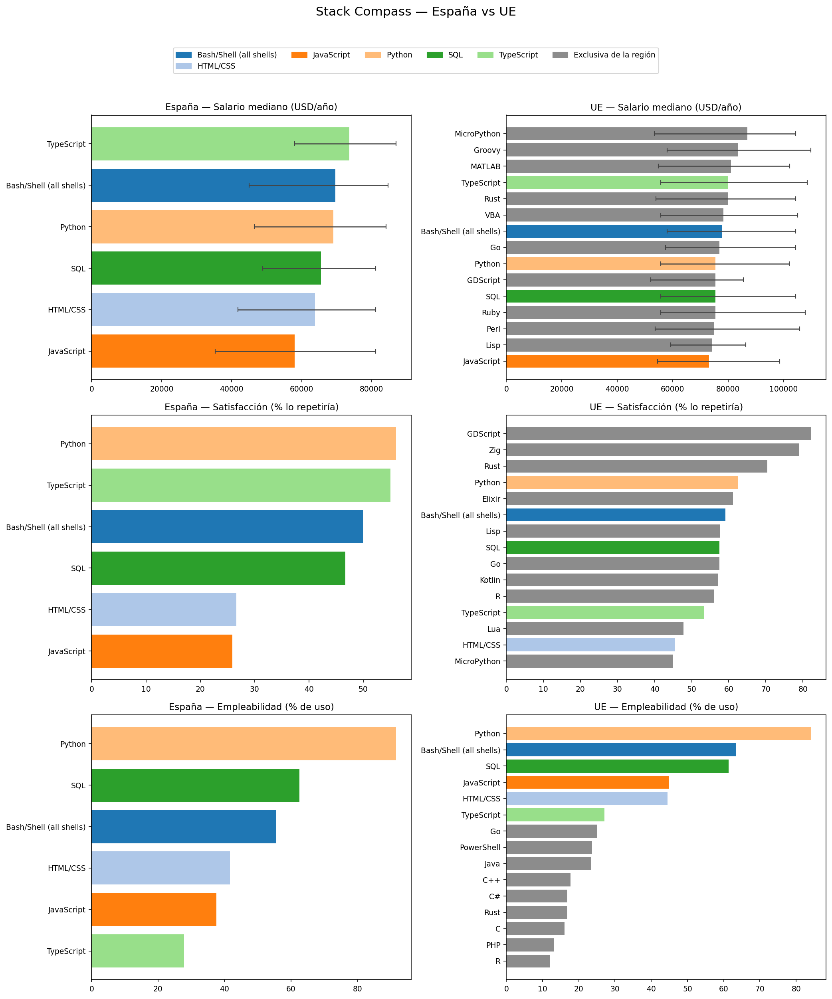

# Stack Compass

¿Qué stack tecnológico maximiza **salario, satisfacción y empleabilidad** para un perfil data/IA, y en qué se diferencia España del resto de la UE?

Análisis de la **Stack Overflow Annual Developer Survey 2025** (49.191 respuestas) centrado en roles data/IA, comparando **España vs UE-sin-España**.

## Hallazgos



- **Empleabilidad — Python es casi monocultivo en España.** Lo usa ~92% del perfil data/IA español, frente a ~83% en la UE. La diferencia real es la dispersión: la UE reparte el uso entre muchas más tecnologías (Go, Rust, C#, Java…); el stack data español se concentra en un puñado.
- **Satisfacción — el contraste más claro.** En España, Python y TypeScript lideran la retención (~55%), pero HTML/CSS y JavaScript caen a ~26%: la mitad de quien los usa no los repetiría. En la UE el top lo copan techs emergentes (GDScript, Zig, Rust: 70–82%) sin muestra suficiente en España. De las techs comunes, Python gana en satisfacción en ambas regiones.
- **Salario — banda estrecha y muy incierta en España.** Las medianas se apiñan entre ~58k (JavaScript) y ~75k (TypeScript) USD, con Python y Bash/Shell rondando los 70k. Las barras de error p25–p75 son casi tan anchas como las propias barras: con 70 personas con salario, el ranking salarial español es orientativo, no concluyente. La UE paga más en todo y reparte los sueldos altos entre más tecnologías (Rust, Go, MATLAB).
- **El hallazgo que enmarca todo:** España supera el umbral n≥15 en solo 6 tecnologías por métrica; la UE en 15. No es una carencia del análisis — es el retrato de un mercado más pequeño donde pocas tecnologías alcanzan masa crítica. La comparación se juega en esas 6 comunes (Python, SQL, Bash/Shell, JavaScript, HTML/CSS, TypeScript).

## Método

**Población.** Filtrada por rol declarado (`DevType`), **no** por stack — así se evita la circularidad de definir el colectivo por la misma variable que se estudia. Núcleo: Data engineer, AI/ML engineer, Data scientist, Data/business analyst, Applied scientist, Developer (AI apps). Frontera: DevOps, Cloud infrastructure engineer.

**Regiones.** Columna derivada `Region`: España vs UE-sin-España (27 estados miembro; UK fuera).

**Métricas** (una columna de stack por métrica, sobre `LanguageHaveWorkedWith`):
- **Salario** — `ConvertedCompYearly`, mediana (nunca media). Outliers fuera de 5.000–300.000 USD → `NaN`.
- **Empleabilidad** — % que declara usar cada tech, sobre *quien contestó la pregunta de stack* en esa región. Así una menor tasa de respuesta no se disfraza de menor adopción.
- **Satisfacción** — `LanguageAdmired` = usó Y repetiría. Score = (admiran X) ÷ (usaron X) × 100. Es una tasa de retención.

**Fiabilidad.** Solo techs con **n ≥ 15** en la región. Comparaciones en %/medianas, nunca en conteos brutos (España: 80 filas, 70 con salario; UE: 1.114). La asimetría de muestra lo obliga.

## Stack técnico

- **pandas** — ingesta, limpieza y normalización
- **DuckDB** — SQL embebido para las métricas (unnest, window functions)
- **matplotlib** — el dashboard comparativo
- **Jupyter** — análisis narrado

## Estructura
stack-compass/
├── data/
│ ├── raw/ # CSV crudo de la encuesta (no versionado)
│ └── processed/ # salida del pipeline de limpieza
├── figures/
│ └── dashboard.png # figura 3×2 España vs UE
├── notebooks/
│ └── 01_analisis.ipynb # análisis narrado
├── src/
│ ├── load.py # load_raw(), get_duckdb_connection(), load_processed()
│ ├── clean.py # filter_population(), filter_geography(), add_region(), clean_salary()
│ ├── metrics.py # salary_by_stack(), satisfaction_by_stack(), employability_by_stack()
│ ├── plots.py # build_dashboard()
│ └── run.py # pipeline completo de una tirada
├── pyproject.toml
└── README.md


## Reproducir

Requiere [uv](https://github.com/astral-sh/uv). El CSV crudo no está versionado: descárgalo de la [Stack Overflow Developer Survey](https://survey.stackoverflow.co/) y colócalo en `data/raw/results.csv`.

```bash
git clone https://github.com/miluclash/Stack-Compass.git
cd Stack-Compass
uv sync

# pipeline completo: limpia → 3 métricas → imprime tablas → genera figures/dashboard.png
uv run python -m src.run

# análisis narrado
uv run jupyter notebook notebooks/01_analisis.ipynb
```

---
*Proyecto de portfolio — [Michael](https://github.com/miluclash).*